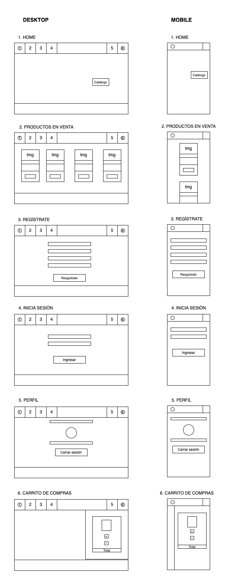

**ESTA ES LA DESCRICIÓN DEL PROYECTO**

Descubre el mundo de la moda desde la comodidad de tu dispositivo con nuestra aplicación de venta de ropa. Explora una amplia selección de estilos y tendencias, desde prendas casuales hasta elegantes atuendos, todo al alcance de tus dedos. Navega a través de fotos de alta calidad y encuentra las piezas perfectas para complementar tu estilo único. Con opciones de pago seguras y envío rápido, experimenta la conveniencia de renovar tu armario con solo unos clics. ¡Descarga la aplicación y viste con confianza en cada ocasión!

#### IMPORTANTE: 
    1. Para realizar una compra, es necesario iniciar sesión.
    

#### Contenido
	1. Aplicación de venta de ropas.

#### Secciones:
	1. Header
	2. Home
	3. Productos en venta
    4. Perfil
    5. Login
    6. Registrar usuario
    7. Footer
    8. Listado de productos en carrito de compra
	

#### Tecnologías utilizadas
	1. HTML
	2. CSS
    3. Framework - bootstrap - React 
    4. Express js
    5. Base de datos MongoDB

#### Mockup

#### Agradecimientos  
> Bootcamp UDD